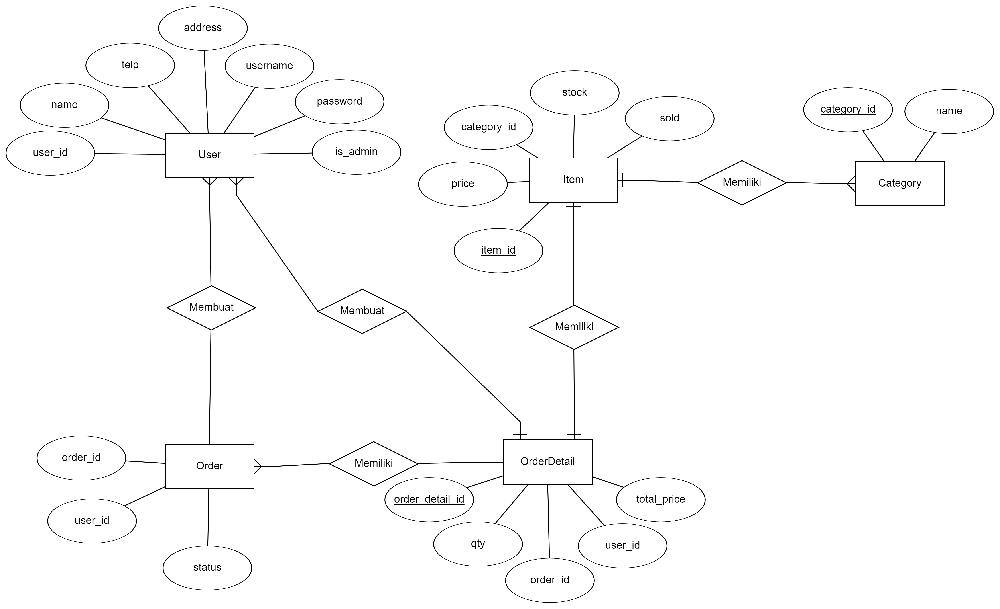

## API Requirement

### User :

- Login 
- Regiter
- Get List Category
- Get Detail Category By Id
- Get List Item 
- Create Order [Auth bearer token user]
- Get Detail Pending Order [Auth bearer token user]
- Submit Order  [Auth bearer token user]
- Change Password [Auth bearer token user]
- Update Profile User [Auth bearer token user]

### Admin
  
 All endpoint admin with [Auth bearer token admin]
 - Login [is_admin = true]
 - Add Item 
 - Update Item
 - Delete Item 
 - Add Category 
 - Update Category
 - Delete Category
 - Change Status Order [choose body: Processed / Completed / Canceled]
 - List Order [can add query: complete]

## Install

1. clone this project `git clone https://github.com/bimaagung/bingle-shop-api.git`
2. Install Package `npm install`
3. configuration db and server in file `.env`
4. run terminal server `npm run start` or `npm run start-dev`[with nodemon] 
5. import file postman 
6. try api url endpoint in postman
7. For private endpoints don't forget to add bearer token (user/admin) in postman

 
## Package
 - bcrypt  = encrypt password 
 - dotenv = create environment variabel 
 - express = framework node js
 - joi = form validation
 - jsonwebtoken = create token auth
 - morgan = HTTP request logger middleware
 - pg = adapter postgres
 - pg-hstore = adapter postgres
 - sequelize = orm database
 - sequelize-cli = command orm database

## ERD

  
  
  

