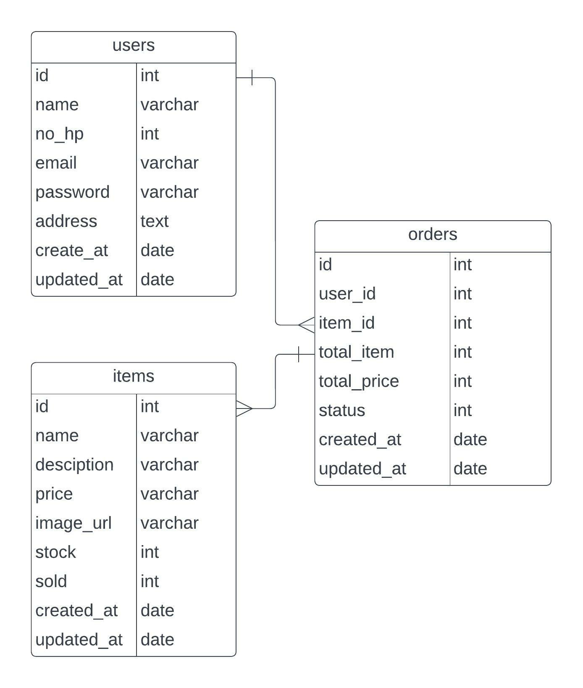

## API Requirement

### User :

- Login 
- Regiter
- Get List Category
- Get Detail Category By Id
- Get List Item [can add query: category]
- Create Order
- Get Detail Pending Order
- Submit Order

### Admin
 
 - Login [is_admin = true]
 - Add Item
 - Update Item
 - Delete Item
 - Add Category
 - Update Category
 - Delete Category
 - Change Status Order [choose body: Processed / Completed / Canceled]
 - List Order [can add query: complete]
 
## ERD

  
  
  

